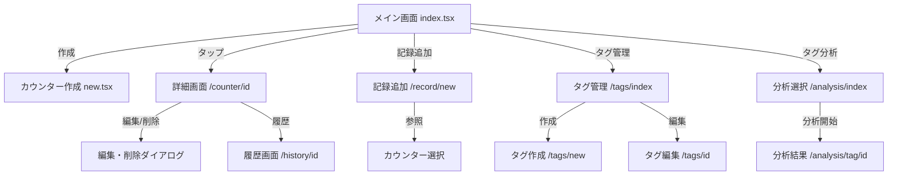

# 画面遷移フロー

## 概要

アプリ全体の画面遷移フローを定義します。ユーザーがどの画面からどの画面に遷移できるかを明確にします。

## 画面遷移図



## 画面遷移の詳細

### メイン画面（`app/(tabs)/index.tsx`）

**遷移先**:
- **カウンター作成** (`/(tabs)/counter/new`)
  - アクション: 「カウンター作成」ボタンをタップ
  - 戻り: 作成完了後、メイン画面に戻る

- **カウンター詳細** (`/(tabs)/counter/[id]`)
  - アクション: カウンターカードをタップ
  - 戻り: 戻るボタンまたはナビゲーション

- **記録追加** (`/(tabs)/record/new`)
  - アクション: 「記録を追加」ボタンをタップ
  - 戻り: 記録追加完了後、メイン画面に戻る

- **タグ管理** (`/(tabs)/tags`)
  - アクション: 「タグ管理」ボタンをタップ
  - 戻り: タブナビゲーションまたは戻るボタン

- **タグ分析選択** (`/(tabs)/analysis`)
  - アクション: 「タグ分析」ボタンをタップ
  - 戻り: タブナビゲーションまたは戻るボタン

### カウンター詳細画面（`app/(tabs)/counter/[id].tsx`）

**遷移先**:
- **履歴画面** (`/(tabs)/history/[counterId]`)
  - アクション: 「履歴を見る」ボタンをタップ
  - 戻り: 戻るボタン

**アクション**:
- **削除**: 確認ダイアログ表示後、カウンターを削除してメイン画面に戻る
- **カウント操作**: 画面内で実行（遷移なし）

### 記録追加画面（`app/(tabs)/record/new.tsx`）

**遷移先**:
- **カウンター作成** (`/(tabs)/counter/new`)
  - アクション: カウンターが存在しない場合の「カウンターを作成」リンク
  - 戻り: 作成完了後、記録追加画面に戻る

**戻り**:
- 記録追加完了後、メイン画面に戻る

### タグ管理画面（`app/(tabs)/tags/index.tsx`）

**遷移先**:
- **タグ作成** (`/(tabs)/tags/new`)
  - アクション: 「タグを作成」ボタンをタップ
  - 戻り: 作成完了後、タグ管理画面に戻る

- **タグ編集** (`/(tabs)/tags/[id]`)
  - アクション: タグカードをタップ
  - 戻り: 更新完了後、タグ管理画面に戻る

**アクション**:
- **削除**: 確認ダイアログ表示後、タグを削除（画面内で実行）

### タグ分析選択画面（`app/(tabs)/analysis/index.tsx`）

**遷移先**:
- **タグ分析結果** (`/(tabs)/analysis/tag/[tagId]`)
  - アクション: タグを選択して「分析開始」ボタンをタップ
  - パラメータ: 選択されたタグID（複数可）
  - 戻り: 戻るボタン

### タグ分析結果画面（`app/(tabs)/analysis/tag/[tagId].tsx`）

**戻り**:
- 戻るボタンでタグ分析選択画面に戻る

### 履歴画面（`app/(tabs)/history/[counterId].tsx`）

**戻り**:
- 戻るボタンでカウンター詳細画面に戻る

## タブナビゲーション

アプリは以下のタブで構成されています：

1. **ホーム** (`/(tabs)/index.tsx`) - メイン画面
2. **分析** (`/(tabs)/analysis/index.tsx`) - タグ分析選択
3. **タグ** (`/(tabs)/tags/index.tsx`) - タグ管理

各タブから直接アクセス可能な画面：
- ホームタブ: メイン画面、カウンター詳細、記録追加、カウンター作成
- 分析タブ: タグ分析選択、タグ分析結果
- タグタブ: タグ管理、タグ作成、タグ編集

## ナビゲーションの原則

### 1. 階層構造
- **メイン画面**が最上位
- **詳細画面**はメイン画面から遷移
- **作成・編集画面**は各管理画面から遷移

### 2. 戻り動作
- **作成・編集画面**: 完了後、前の画面に戻る
- **詳細画面**: 戻るボタンで前の画面に戻る
- **タブ画面**: タブナビゲーションで切り替え

### 3. モーダル表示
- **確認ダイアログ**: 削除などの重要な操作で表示
- **エラー画面**: エラー発生時に表示

## 画面遷移の実装

### Expo Routerの使用

```typescript
import { useRouter } from 'expo-router';

const router = useRouter();

// 画面遷移
router.push('/(tabs)/counter/new');
router.push(`/(tabs)/counter/${counterId}`);
router.back(); // 前の画面に戻る
```

### パラメータの渡し方

```typescript
// パスパラメータ
router.push(`/(tabs)/counter/${counterId}`);
router.push(`/(tabs)/history/${counterId}`);

// クエリパラメータ
router.push(`/(tabs)/analysis/tag/${tagId}?tags=${selectedTags.join(',')}`);
```

### パラメータの取得

```typescript
import { useLocalSearchParams } from 'expo-router';

const { id } = useLocalSearchParams<{ id: string }>();
const { tagId, tags } = useLocalSearchParams<{ tagId: string; tags?: string }>();
```

## ユーザーフロー例

### フロー1: カウンターを作成してカウントする

1. メイン画面 → 「カウンター作成」ボタン
2. カウンター作成画面 → 名前と説明を入力 → 「作成」
3. メイン画面に戻る → 作成したカウンターカードをタップ
4. カウンター詳細画面 → 「+」ボタンでカウント
5. メイン画面に戻る（自動）

### フロー2: 過去の記録を追加する

1. メイン画面 → 「記録を追加」ボタン
2. 記録追加画面 → カウンター選択 → カウント値入力 → 日時設定 → 「記録を追加」
3. メイン画面に戻る

### フロー3: タグで分析する

1. メイン画面 → 「タグ分析」ボタン
2. タグ分析選択画面 → タグを選択 → 「分析開始」
3. タグ分析結果画面 → 統計情報、カレンダー、グラフを確認
4. 戻るボタンでタグ分析選択画面に戻る

### フロー4: タグを作成して記録に付与する

1. メイン画面 → 「タグ管理」ボタン
2. タグ管理画面 → 「タグを作成」ボタン
3. タグ作成画面 → 名前と色を選択 → 「作成」
4. タグ管理画面に戻る → メイン画面に戻る
5. メイン画面 → 「記録を追加」ボタン
6. 記録追加画面 → タグを選択 → 「記録を追加」

## 参考資料

- [画面・ボタン一覧](./screen-inventory.md) - 各画面の詳細
- [デザインガイドライン](./design-guidelines.md) - デザインシステム
